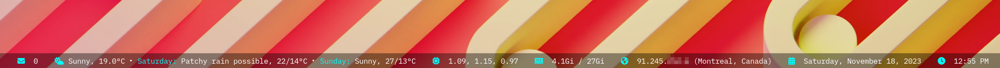

# i3bar config sample w/i3blocks and icons

Nothing fancy, or even well written :D Just a few examples of a working solution


This is the `bar` key of my i3wm config file:

```
bar {
  i3bar_command i3bar --transparency
  status_command i3blocks
  separator_symbol "   "
  font pango: IBM Plex Mono, Font Awesome 6 Free Solid
  tray_padding 4
  padding 0 40px 5px 0
  workspace_min_width 30px

  colors {
    background #00000066
    separator #00ff00

    focused_workspace #00000066 #ffffff #000000
    inactive_workspace #00000066 #00000066 #ffffff
  }
}
```

You have to compile the _Golang_ code and put the executables in your `$PATH`


Rendered sample:




For the icons, in Fedora I installed the package:

`fontawesome-6-free-fonts.noarch`